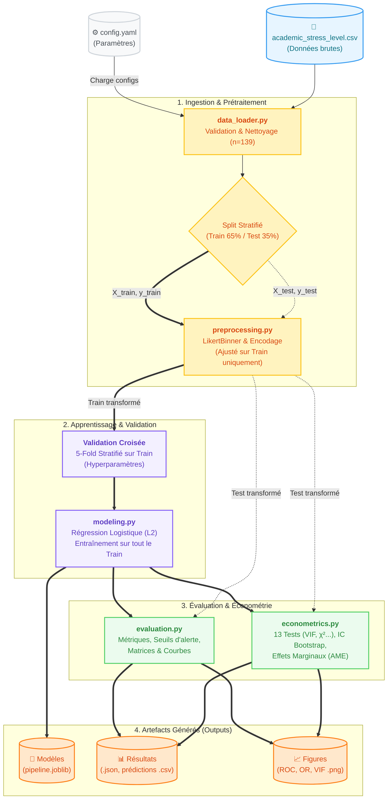

# Academic Stress Index — Prediction & Analysis

> Identification des étudiants à haut risque de stress académique par régression logistique,  
> avec une batterie complète de tests économétriques et statistiques.

[](https://www.python.org/)
[](https://scikit-learn.org/)
[](https://pandas.pydata.org/)
[](https://pytest.org/)
[](https://www.kaggle.com/datasets/poushal02/student-academic-stress-real-world-dataset)
[](https://github.com/maxime2476/academic_stress_index_predict)
[](https://github.com/maxime2476/academic_stress_index_predict)

---

## Contexte

Ce projet analyse les facteurs associés au **stress académique** chez 140 étudiants (enquête
auto-administrée, juillet–août 2025) et construit un modèle de régression logistique binaire
pour identifier les étudiants à *haut niveau de stress* (indice ≥ 4/5).

**Objectif principal :** outiller les services de santé universitaire pour un dépistage
précoce, en hiérarchisant les facteurs de risque par ordre d'impact.

---

## Structure du projet

```
academic_stress_index_predict/
│
├── config.yaml                  # Tous les paramètres (chemins, modèle, seuils…)
├── requirements.txt             # Dépendances Python
├── .gitignore
│
├── data/
│   └── academic_stress_level.csv   # Données brutes (n=140)
│
├── src/                         # Modules source réutilisables
│   ├── config.py                # Chargement centralisé de config.yaml
│   ├── data_loader.py           # Ingestion, validation, nettoyage
│   ├── preprocessing.py         # Pipeline sklearn (binarisation + encodage)
│   ├── modeling.py              # Entraînement, CV, seuils, bootstrap OR
│   ├── evaluation.py            # Métriques, figures, exports
│   ├── econometrics.py          # Batterie de 13 tests économétriques
│   └── utils.py                 # Logging, JSON, utilitaires
│
├── scripts/                     # Scripts exécutables
│   ├── run_analysis.py          # Pipeline complet (entraînement → exports)
│   └── run_econometrics.py      # Tests économétriques seuls
│
├── tests/                       # Suite pytest
│   ├── conftest.py              # Fixtures partagées (données synthétiques)
│   ├── test_data_loader.py
│   ├── test_preprocessing.py
│   ├── test_modeling.py
│   ├── test_evaluation.py
│   └── test_econometrics.py
│
├── notebooks/
│   └── academic_stress_notebook.ipynb   # Exploration visuelle uniquement
│
└── outputs/                     # Artefacts générés (ignorés par git)
    ├── figures/                 # PNG (ROC, PR, confusion matrix, OR…)
    ├── results/                 # JSON + CSV (métriques, prédictions)
    └── models/                  # Modèle sérialisé (joblib)
```

---

## Installation

```bash
# 1. Cloner le dépôt
git clone https://github.com/maxime2476/academic_stress_index_predict.git
cd academic_stress_index_predict

# 2. Créer un environnement virtuel (recommandé)
python -m venv .venv
# Windows :
.venv\Scripts\activate
# macOS / Linux :
source .venv/bin/activate

# 3. Installer les dépendances
pip install -r requirements.txt
```

---

## Utilisation

### Analyse complète (recommandé en premier)

```bash
python scripts/run_analysis.py
```

Produit dans `outputs/` :
- `results/full_results.json`        — toutes les métriques (AUC, PR-AUC, Brier, seuils…)
- `results/predictions_test.csv`     — prédictions sur le jeu de test
- `results/scores_full.csv`          — probabilités pour l'ensemble des données
- `models/logistic_regression.joblib`— modèle + pipeline sérialisés
- `figures/roc_curve.png`, `pr_curve.png`, `confusion_matrix.png`,
  `calibration_curve.png`, `odds_ratios.png`, `threshold_comparison.png`

### Tests économétriques

```bash
python scripts/run_econometrics.py
```

Produit :
- `results/econometrics_report.json`
- `figures/vif_barplot.png`, `wald_coefficients.png`,
  `marginal_effects.png`, `spearman_heatmap.png`, `cramers_v_associations.png`

### Suite de tests

```bash
# Tous les tests avec rapport de couverture
pytest tests/ -v --cov=src --cov-report=term-missing

# Un module spécifique
pytest tests/test_econometrics.py -v
```

### Notebook exploratoire

```bash
jupyter notebook notebooks/academic_stress_notebook.ipynb
```

Le notebook se concentre sur la **visualisation et l'interprétation** des résultats.
Il charge les sorties générées par les scripts plutôt que de réexécuter l'analyse.

---

## Données

| Variable | Type | Valeurs | Rôle |
|---|---|---|---|
| Timestamp | datetime | juil.–août 2025 | Métadonnée |
| Your Academic Stage | Nominal | undergraduate, high school, post-graduate | Prédicteur |
| Peer pressure | Ordinal (Likert) | 1–5 | Prédicteur |
| Academic pressure from your home | Ordinal (Likert) | 1–5 | Prédicteur |
| Study Environment | Nominal | Peaceful, Noisy, disrupted | Prédicteur |
| Coping strategy | Nominal | 3 modalités | Prédicteur |
| Bad habits | Nominal | No, Yes, prefer not to say | Prédicteur |
| Academic competition | Ordinal (Likert) | 1–5 | Prédicteur |
| **Rate your academic stress index** | **Ordinal (Likert)** | **1–5** | **Cible** |

**Variable cible binarisée :** `HighStress = 1` si indice ≥ 4 (configurable dans `config.yaml`).

**Qualité des données :**
- 140 réponses collectées, 1 ligne supprimée (valeur manquante `Study Environment`)
- Analyse finale : **n = 139**

---

## Méthodologie

### Prétraitement (sans fuite de données)

1. **Regroupement ordinal :** les scores Likert 1–5 sont discrétisés en trois bandes
   (`1-2` = faible, `3` = moyen, `4-5` = élevé) pour réduire la dispersion
   tout en préservant l'ordre.
2. **Encodage ordinal :** `OrdinalEncoder` (0/1/2) pour les variables Likert regroupées.
3. **One-Hot Encoding** avec `drop='first'` pour les variables nominales
   (évite la multicolinéarité parfaite dans la matrice de design).
4. Le pipeline sklearn est **ajusté uniquement sur les données d'entraînement**,
   puis appliqué au jeu de test — aucune fuite d'information.

### Modèle

- **Régression logistique** (`liblinear`, pénalisation L2, `class_weight='balanced'`)
- Découpage stratifié train/test : 65 % / 35 % (graine fixée pour reproductibilité)
- Validation croisée stratifiée à 5 plis sur l'ensemble complet

### Optimisation du seuil de décision

Trois seuils sont calculés et comparés :

| Seuil | Méthode | Usage |
|---|---|---|
| `f1_optimised` | Maximise le F1-score | Équilibre précision/rappel |
| `operational` (t=0.465) | Validé manuellement | **Déploiement recommandé** |
| `cost_minimised` | Minimise FN×3 + FP×1 | Prioriser la détection exhaustive |

### Intervalles de confiance sur les Odds Ratios

Bootstrap non-paramétrique (B=500 rééchantillonnages) pour les IC à 95 % des OR.

---

## Résultats principaux

### Performance (jeu de test, seuil opérationnel t=0.465)

| Métrique | Valeur |
|---|---|
| AUC-ROC | **0.747** |
| PR-AUC | **0.857** |
| Brier score | 0.203 |
| Accuracy | 0.735 |
| Sensibilité (recall) | 0.806 |
| Spécificité | 0.611 |
| F1 | 0.733 |

### Validation croisée (5-fold, dataset complet)

| Métrique | Moyenne ± Écart-type |
|---|---|
| AUC-ROC | 0.699 ± 0.054 |
| PR-AUC | 0.801 ± 0.021 |

*La cohérence entre les performances test et CV indique une bonne généralisation.*

### Facteurs de risque principaux (Odds Ratios bootstrap)

| Facteur | OR | IC 95% | Interprétation |
|---|---|---|---|
| Compétition académique élevée (4-5) | **3.04** | [1.19, 3.89] | Risque × 3 vs. faible |
| Pression des pairs élevée (4-5) | **2.23** | [1.2, 3.5] | Risque × 2.2 |
| Pression familiale élevée (4-5) | **1.82** | [1.0, 3.0] | Risque × 1.8 |

---

## Tests économétriques

La batterie de 13 tests (`scripts/run_econometrics.py`) couvre :

| # | Test | Ce qu'il mesure |
|---|---|---|
| 1 | **VIF** | Multicolinéarité entre prédicteurs (seuil d'alerte : VIF ≥ 5) |
| 2 | **Hosmer-Lemeshow** | Qualité d'ajustement — probabilités prédites vs. observées |
| 3 | **Likelihood Ratio Test** | Gain du modèle plein vs. modèle nul (constante seule) |
| 4 | **Tests de Wald** | Significativité individuelle de chaque coefficient |
| 5 | **McFadden R²** | Pouvoir explicatif global (log-vraisemblance) |
| 6 | **Cox-Snell R²** | Pseudo-R² (ne sature pas à 1 pour données binaires) |
| 7 | **Nagelkerke R²** | Cox-Snell normalisé pour atteindre [0, 1] |
| 8 | **AIC / BIC** | Critères d'information (compromis ajustement/complexité) |
| 9 | **Pearson / Déviance** | Adéquation globale vs. modèle saturé |
| 10 | **Cramér's V + IC bootstrap** | Force d'association catégorielle avec la cible |
| 11 | **Kruskal-Wallis + Mann-Whitney** (Bonferroni) | Différences de stress entre groupes catégoriels |
| 12 | **Corrélations de Spearman** | Relations ordinales entre prédicteurs et indice de stress |
| 13 | **Effets marginaux moyens (AME)** | ΔP(HighStress=1) par unité d'augmentation de chaque prédicteur |

---

## Architecture du code

### Principe de séparation des responsabilités



Chaque module est **indépendamment testable** via les fixtures synthétiques de `tests/conftest.py`.
Aucun test ne dépend du fichier CSV réel.

### Prévention des fuites de données

Le pipeline sklearn est instancié et ajusté **uniquement sur `X_train`**, puis appliqué
séparément à `X_test`. Les étapes de binning et d'encodage n'observent jamais les données
de test pendant l'entraînement.

---

## Limites et perspectives

**Limites actuelles :**
- Taille d'échantillon modeste (n=139) — puissance statistique limitée
- Données auto-rapportées (biais de désirabilité sociale possible)
- Population non représentative (échantillon de convenance, courte période)
- Modèle linéaire en log-odds — interactions entre variables non capturées

**Extensions possibles :**
- Tester des modèles non-linéaires (Random Forest, XGBoost) avec SHAP
- Régression logistique ordinale sur le score brut 1–5 (davantage d'information)
- Collecte longitudinale pour analyser l'évolution du stress dans le temps
- Analyse de sous-groupes (niveau d'études, discipline académique)
- Validation externe sur un autre échantillon

---

## Dépendances principales

| Package | Usage |
|---|---|
| `scikit-learn` | Pipeline, encodeurs, métriques ML |
| `statsmodels` | VIF |
| `scipy` | Tests statistiques (χ², Kruskal-Wallis, Spearman…) |
| `pandas / numpy` | Manipulation des données |
| `matplotlib / seaborn` | Visualisations |
| `joblib` | Sérialisation du modèle |
| `PyYAML` | Lecture de `config.yaml` |
| `pytest` | Suite de tests |

---
